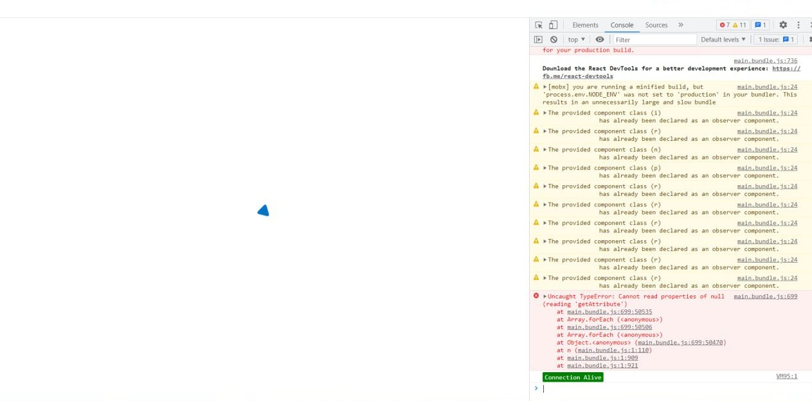

# Evernode Simple Emulator (SE)

Local Node with GraphQL API for DApp development and testing in TVM compatible blockchains (Everscale, Venom, TON, Gosh, etc.).

<p align="center">
  <a href="https://docs.everscale.network/">
    
  </a>
  <a href="https://github.com/venom-blockchain/developer-program">
    
  </a>
</p>


**Have a question? Get quick help in our channel:**

[](https://t.me/ever_sdk)

- [Evernode Simple Emulator (SE)](#evernode-simple-emulator-se)
  - [What is Evernode Simple Emulator?](#what-is-evernode-simple-emulator)
  - [Use-cases](#use-cases)
  - [How to install](#how-to-install)
    - [Pre-requisites](#pre-requisites)
    - [Install via EVERDEV Development Environment](#install-via-everdev-development-environment)
    - [Install via docker command](#install-via-docker-command)
  - [How to change the blockchain configuration](#how-to-change-the-blockchain-configuration)
  - [How to work with logs](#how-to-work-with-logs)
  - [How to connect to Evernode SE Graphql API from SDK](#how-to-connect-to-evernode-se-graphql-api-from-sdk)
  - [Evernode SE components](#evernode-se-components)
  - [Ever Live explorer](#ever-live-explorer)
  - [How to build docker image locally](#how-to-build-docker-image-locally)
    - [Linux/Mac:](#linuxmac)
    - [Windows:](#windows)
  - [Memory limits](#memory-limits)
- [SE live control (REST API)](#se-live-control-rest-api)
- [Note for SE Developers](#note-for-se-developers)
- [Troubleshooting](#troubleshooting)
  - [Error: connect ENOENT /var/run/docker.sock](#error-connect-enoent-varrundockersock)
  - [Ever.live at localhost isn't available](#everlive-at-localhost-isnt-available)

## What is Evernode Simple Emulator?

Evernode Simple Emulator (SE) is a local instance of Evernode Platform that developer can run on their machine in one click to test applications locally. 

At the moment we publish Evernode SE only as
a [docker image](https://hub.docker.com/r/tonlabs/local-node).
But you can access non-docker builds of SE in community repos:

## Use-cases

- Test your applications locally
- Test your contracts
- Run SE remotely on a server and test your application on a light local network from different devices.

## How to install

### Pre-requisites

- Latest [Docker](https://www.docker.com/get-started) installed

**Attention!** [Docker daemon](https://www.docker.com/get-started) must be running.

### Install via EVERDEV Development Environment

If you have [EVERDEV installed globally on your machine](https://github.com/tonlabs/everdev), run
this command

```commandline
$ everdev se start
```

[Checkout other Evernode SE commands accessible from EVERDEV](https://docs.ton.dev/86757ecb2/p/54722f-tonos-se)
.
You can also access these commands
from [EVERDEV VS Code Extension](https://github.com/tonlabs/tondev-vscode).

### Install via docker command

Run this command

```commandline
$ docker run -d --name local-node -e USER_AGREEMENT=yes -p80:80 tonlabs/local-node
```

To check that SE has been installed successfully check its local playground
at http://0.0.0.0/graphql.
For Windows, use http://127.0.0.1/graphql or http://localhost/graphql.

If you specified another port then add it to the local url http://0.0.0.0:port/graphql

[Find out more about GraphQL API](https://docs.ton.dev/86757ecb2/p/793337-graphql-api).

## How to change the blockchain configuration

Evernode SE loads the blockchain configuration (config params) during its start from the
configuration file
[blockchain.conf.json](docker/ton-node/blockchain.conf.json) instead of special smart contract,
which stores
various config params in the real networks.

In order to change some of these params, do the following:

1. Get [blockchain.conf.json](docker/ton-node/blockchain.conf.json) file and store it to the host's
   filesystem
   accessible by docker. In our example we store it at `/home/user/blockchain.conf.json`.
2. Edit the downloaded file, changing parameters you need. If one of the parameters is omitted or
   renamed, Evernode SE will not start.
3. Create a new docker container, overriding its configuration file
   (its path in the image is `/ton-node/blockchain.conf.json`) with the file from the host's
   filesystem.
   Change `/home/user/blockchain.conf.json` to correct path pointing to the edited blockchain
   configuration file:

```commandline
$ docker run -d --name local-node -e USER_AGREEMENT=yes -p80:80 \
     -v /home/user/blockchain.conf.json:/ton-node/blockchain.conf.json \
     tonlabs/local-node
```
4. All the subsequent config changes will require only restart of the created container. 

## How to work with logs

By default, Evernode SE logs the most of the information to the console, which is accessible by the
next command:

```commandline
$ docker logs local-node
```

More verbose logging is configured to `/ton-node/log/` directory inside the running docker
container.
By default, there are two files: `ton-node.log` for all logging and `tvm.log` for tracing of TVM
execution:
code, stack, control registers, gas, etc.

Logging configuration is stored in `/ton-node/log_cfg.yml` file by default,
but you can change this path with ton-node-config file in `log_path` field.
In order to change the default logging verbosity of other parameters, 
you can configure logging in several ways:

1. In the running container by changing `/ton-node/log_cfg.yml` file:

```commandline
$ docker exec -it local-node bash
bash-5.0# vi /ton-node/log_cfg.yml
```

(in order to exit from VI editor with saving changes press the `ESC` key, then type `:wq` and press
the `ENTER` key)

Note: `log_cfg.yml` file is normally scanned for changes every 30 seconds, so all changes made to
this file in running
container will be applied only after the scan.

Note: after recreation of the container, all changes made in its files will be lost, so use the
second way, if you need
to keep them.

2. Before starting of the container, download and edit a copy
   of [log_cfg.yml](./docker/ton-node/log_cfg.yml) file, then
   mount this file to container's file system in `docker run` command:

```commandline
$ docker run -d --name local-node -e USER_AGREEMENT=yes -p80:80 \
     -v /home/user/log_cfg.yml:/ton-node/log_cfg.yml \
     tonlabs/local-node
```

After starting of Evernode SE, you can edit this file in your file system without restart.

More information about log4rs
configuration [in the log4rs documentation](https://docs.rs/log4rs/1.0.0/log4rs/).

## How to connect to Evernode SE Graphql API from SDK

**Attention** at the moment there are a
few [differences in SE behaviour comparing with a real TON blockchain](https://docs.everos.dev/evernode-platform/products/simple-emulator-se#23854b)
. Read about them before you start implemennting. Please note that we plan to upgrade the SE
behaviour in the next releases so that it will work the same way as a real network.

To connect to local blockchain from your
application specify [SE endpoints](https://docs.everos.dev/evernode-platform/products/simple-emulator-se/endpoint) in SDK Client [network config](https://docs.everos.dev/ever-sdk/guides/installation/configure_sdk#local-node)
.

## Evernode SE components

* [EverX implementation of TON VM written in Rust](https://github.com/tonlabs/ton-labs-vm)
* [ArangoDB database](https://www.arangodb.com/)
* [GraphQL endpoint with web playground](https://docs.everos.dev/ever-sdk/reference/ever-os-api)
* [Ever-live explorer](https://ton.live)
* [Pre-deployed high-performance Giver, ABI v2](contracts)

## Ever Live explorer

Ever Live explorer runs on the same IP and port as Evernode SE, just open http://ip_address:port (
e.g. http://127.0.0.1)

## How to build docker image locally

In order to build and use Evernode Simple Emulator you need Docker.
To build docker image, run from the repository root:

### Linux/Mac:

```commandline
./build.sh
```

### Windows:

```commandline
build.cmd
```

## Memory limits

Evernode SE needs about 1Gb of memory but it is not limited to this value. There is an instance of
ArangoDB inside and GraphQL server running in NodeJS environment which can require more memory
during the high load over a long period of time. If there is a need to hardly limit memory 
consumption then you can change default setting for these services. ArangoDB config is placed at
`/arango/config` and GraphQL server entrypoint is at `/q-server/entrypoint`. There is some minimum 
required memory limits are preconfigured in `./memory/config` for ArangoDB and `./memory/entrypoint`.
You can copy them to `evernode-se` container with the following commands
```commandline
docker cp ./memory/config evernode-se:/arango/config
docker cp ./memory/entrypoint evernode-se:/q-server/entrypoint
```
Memory configuration values for ArangoDB can be found in [official documentation](https://www.arangodb.com/docs/3.10/administration-reduce-memory-footprint.html)

*Note* Node engine also consumes memory and can not be limited. So during the work memory
consumption will be slightly increasing.

**Warning** Memory limitation affects Evernode SE performance so use it only if necessary 

# SE live control (REST API)

Evernode SE has special REST endpoint `/se` that allows to perform *live* control over
running Evernode SE instance.

While the Evernode SE is running it has several properties that effect node behaviour:

- `gen_time_delta` – each time the node issues new block it sets the block's `gen_utime`
  to `now() + gen_time_delta`. When the node starts it sets the `gen_time_delta` to `0`.

SE control commands (must be sent using POST HTTP method):

- `/se/increase-time?delta=<seconds>` – increase `gen_time_delta` by
  specified <seconds> value.

- `/se/reset-time` – resets `gen_time_delta` to `0`.

- `/se/time-delta` – returns current `gen_time_delta` value.

# Note for SE Developers

This repository contains several useful tools for SE development and debugging.
Dev tools resided in `dev` folder and requires [Node.js](https://nodejs.org) to execute (so you have to run `npm i`
inside this folder to prepare dev tools).

If you want to debug SE without docker you have to run evernode-se with following additional
components:

- Q Server (required to communicate with [ever-sdk](https://github.com/tonlabs/ever-sdk)):
    - Checkout `ton-q-server` from [official repository](https://github.com/tonlabs/ton-q-server).
    - Inside `ton-q-server` folder run:
        ```commandline
        npm i
        ```
    - Inside `evernode-se` folder run:
        ```commandline
        node path-to-q-server/index --config ./dev/q-server.json
        ```

- Arango DB (required to `ton-q-server`):
    - Download and install from [official site](https://www.arangodb.com/download-major).
    - Start Arango DB Server.
    - For the first time or if you want to reset database to initial state run:
        ```commandline
        node ./dev/reset-db
        ```

- Evernode SE in debug mode
    ```commandline
    cargo run --release --bin ton_node_startup -- --workdir ./docker/ton-node --config ton-node.conf.json --blockchain-config blockchain.conf.json
    ```

# Troubleshooting

## Error: connect ENOENT /var/run/docker.sock

Getting this error means docker service is not running or missing due to incorrect Docker installation, partiularly in the case of Docker Desktop. Try reinstalling Docker and making sure the [daemon](https://docs.docker.com/config/daemon/start/) is running.

## Ever.live at localhost isn't available

If you use certain adblockers, after you have started Evernode SE the Ever Live explorer at http://127.0.0.1/landing might fail to load (you get a rotating icon and varous warnings and errors in the console).



Try disabling the adblockers for the SE Ever Live explorer.